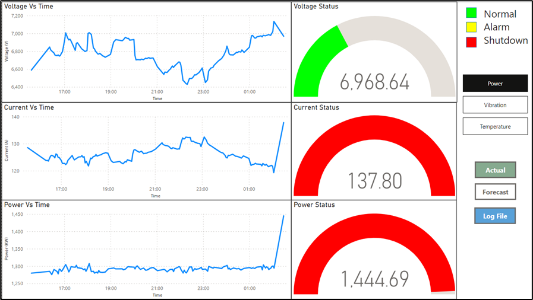
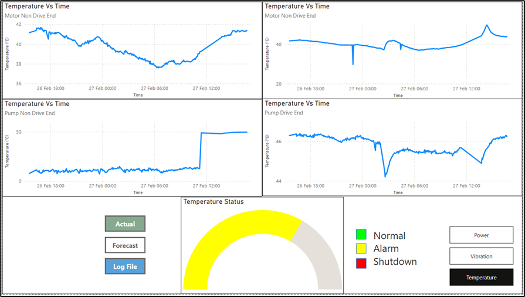
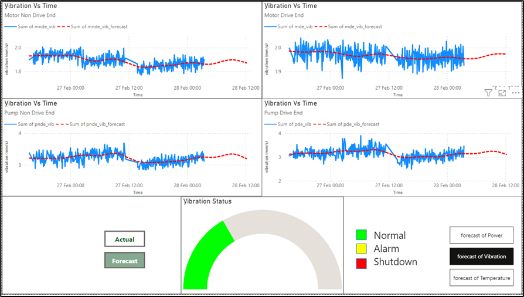

# Pump_predictive_maintenance

## Overview
In contemporary production processes, human operators often oversee operations but may not always intervene promptly during breakdowns. The emergence of Machine Learning (ML) and the Internet of Things (IoT) has revolutionized predictive maintenance systems. These technologies enable real-time monitoring of production processes and the implementation of automated solutions to reduce maintenance frequency and operational failures.

## Objective
This project focuses on predictive maintenance for pump systems using machine learning and forecasting models. By leveraging data from sensors installed on industrial equipment, the goal is to predict potential failures and classify pump conditions to enhance efficiency, minimize downtime, and prolong equipment lifespan.

## Dataset
The dataset, sourced from **Pump Academy**, includes diverse signals generated by water pumps during operation. The data consists of voltage, power, current, and other relevant features. Preprocessing steps involved handling missing values, removing outliers, and performing feature engineering to prepare the data for analysis.

## Exploratory Data Analysis (EDA)
Exploratory Data Analysis was conducted to understand the relationships between key parameters such as voltage, power, and current. This analysis provided insights into normal and anomalous patterns in pump behavior.

## Machine Learning Models
Various machine learning models were implemented to classify pump conditions into three categories: **Normal**, **Alarm**, and **Shutdown**. The models used include:

- **K-Nearest Neighbors (KNN)**
- **Support Vector Machines (SVM)**
- **Random Forest**
- **XGBoost**

Evaluation metrics like **accuracy**, **precision**, and **recall** were used to assess the performance of the models. Rigorous parameter tuning and validation were conducted to enhance model accuracy.

## Forecasting Models
In addition to classification, forecasting models were employed to predict future pump conditions:

- **Prophet**
- **ARIMA**

These models help in predicting trends and potential failures, allowing for proactive maintenance strategies.

## Results
The data pipeline successfully integrates various stages, beginning with importing CSV files for preprocessing. This ensures data integrity by eliminating duplicates and handling null values. Leveraging pre-trained ensemble machine learning models enhances classification accuracy, enabling precise identification of pump system states. 

### Database and Visualization
- The classified data is seamlessly stored in a **SQL database server**, facilitating efficient management and retrieval.
- **Power BI dashboards** provide stakeholders with intuitive insights for informed decision-making.
- The dashboard includes two layouts:
  - **Actual Data Layout:** Conditional monitoring of power, vibration, and temperature, represented by color-coded status gauge meters:
    - Green: Normal operation
    - Yellow: Alarm state
    - Red: Shutdown
  - **Forecasting Layout:** Two lines illustrate actual and predicted values. The solid line represents historical data, while the dotted line depicts future predictions generated by the Prophet model.

The predictive capability of the model improves as historical data accumulates, allowing for more accurate long-term forecasts.

## Snapshots

## Key Takeaways
- **Real-time monitoring, anomaly detection, and predictive analytics** enhance operational efficiency.
- **Database management ensures seamless data storage and retrieval** for better decision-making.
- **Scalability:** The pipeline adapts to growing data volumes, ensuring sustained performance over time.
- **Proactive maintenance strategies** minimize downtime, optimize resource allocation, and improve overall efficiency.

## Technologies Used
- **Python**
- **Machine Learning Libraries:** Scikit-learn, XGBoost
- **Forecasting Libraries:** Prophet, ARIMA
- **Data Analysis:** Pandas, Matplotlib, Seaborn
- **Database:** SQL Server
- **Visualization:** Power BI

## Future Work
- Integration of real-time data streams using IoT platforms
- Deployment of models in industrial environments
- Incorporation of deep learning techniques for improved accuracy

